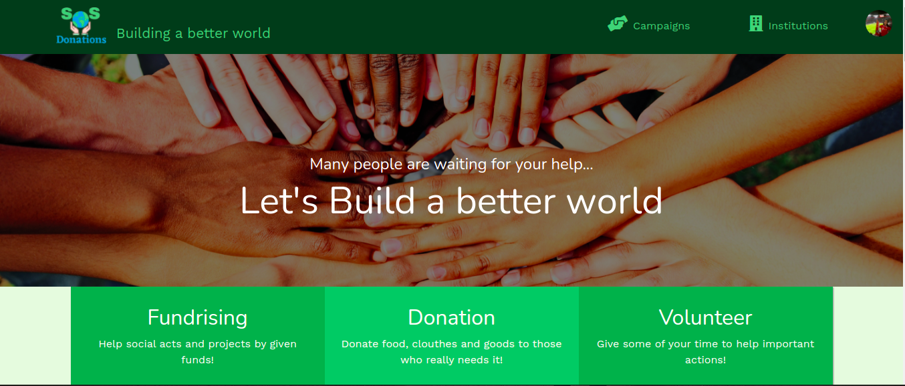
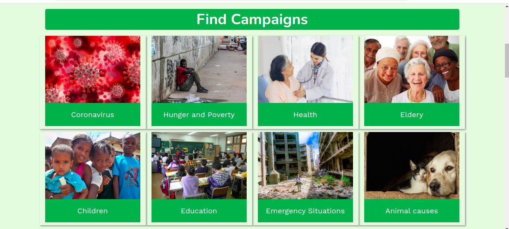
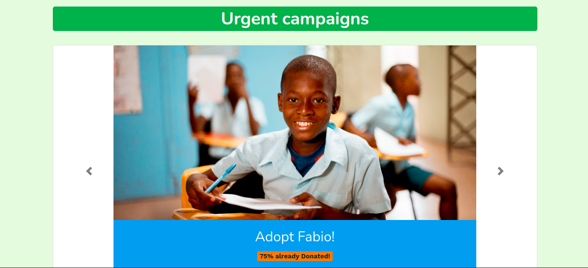
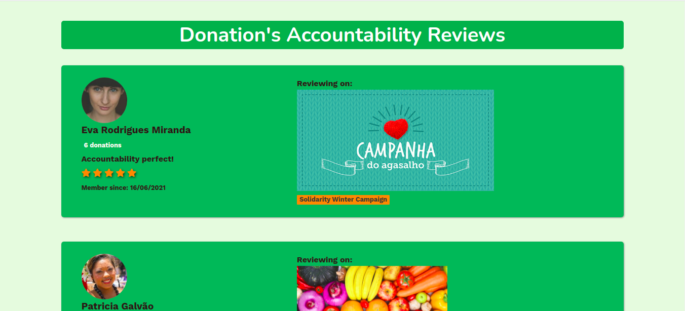
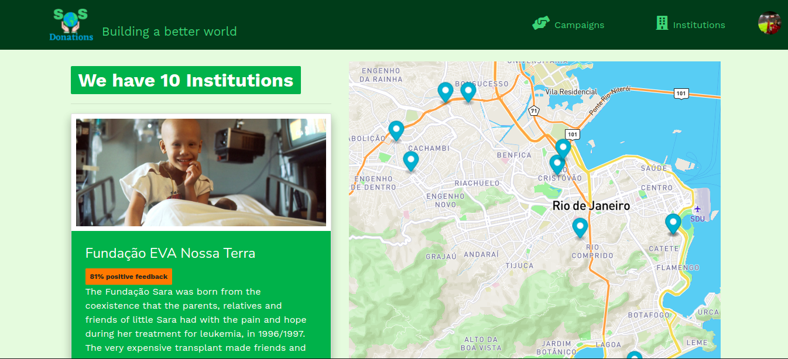
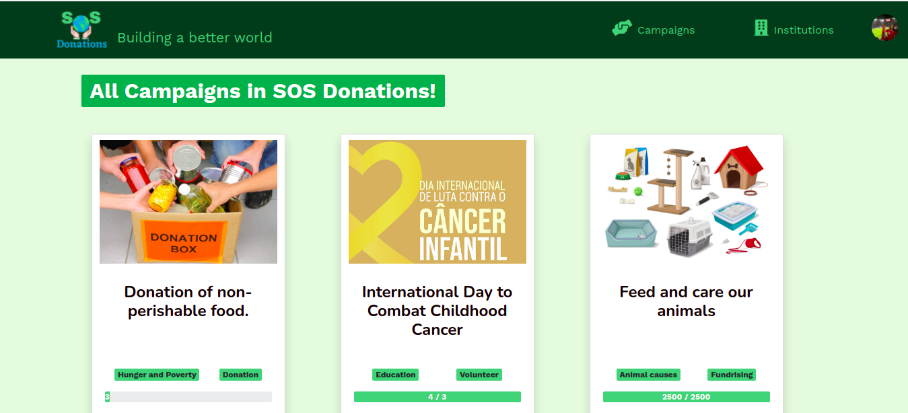
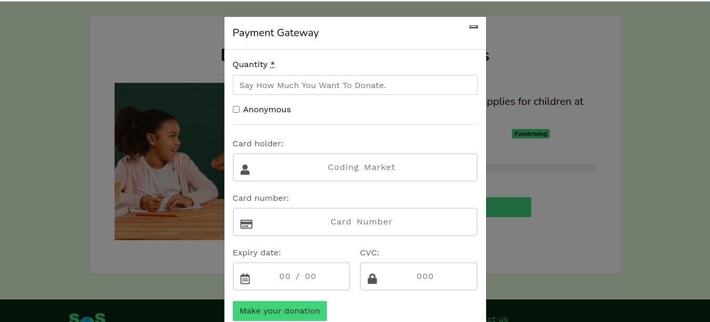
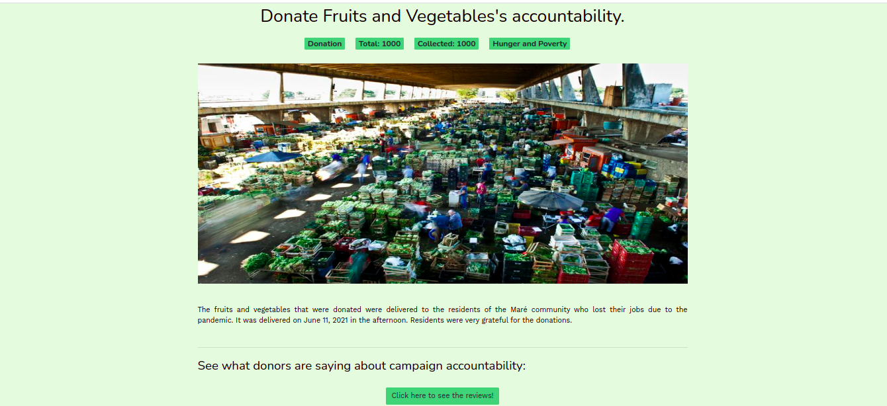
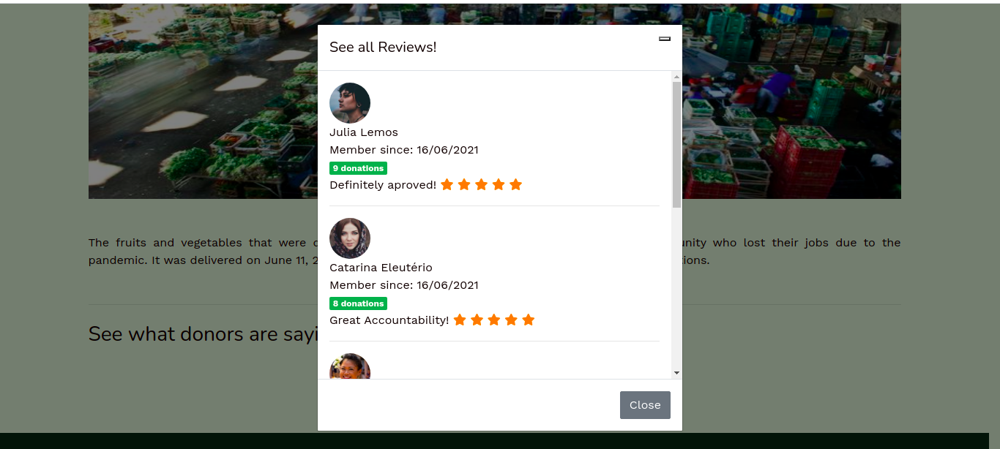
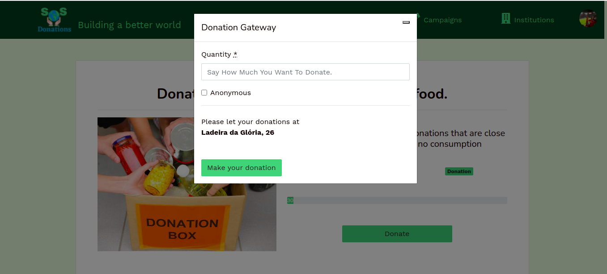

Project made with Ruby on Rails and deployed to Heroku at https://sos-donations.herokuapp.com/.

Project presentation on YouTube: https://www.youtube.com/watch?v=ocH6SNuStps

SOS Donations is a platform for making donations, where it is possible to see the profile of charities, reviews of other donors and view the accountability of completed campaigns where the institution must demonstrate the destination of the donations received. The objective with this reputation system is to generate credibility for the institution and trust in the donor so that they can donate safely.

Made by [Raquel Limâ](https://github.com/RaquelLima7), [Alexandre Gambati](https://github.com/alxgambati) and [Fernanda de Jesus](https://github.com/bussularf).

